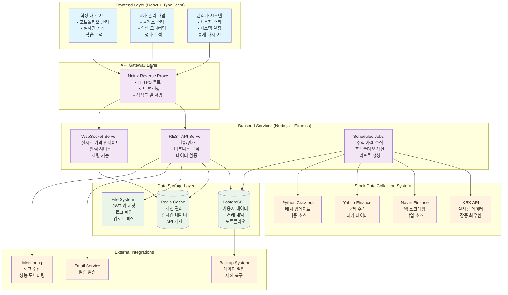
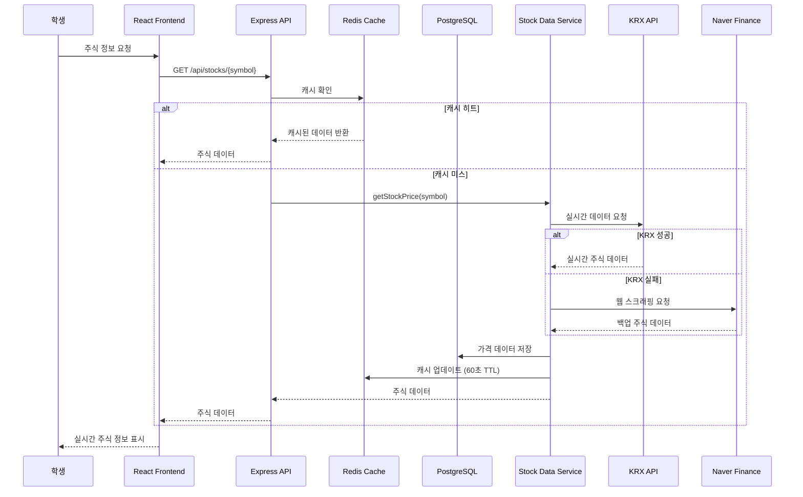
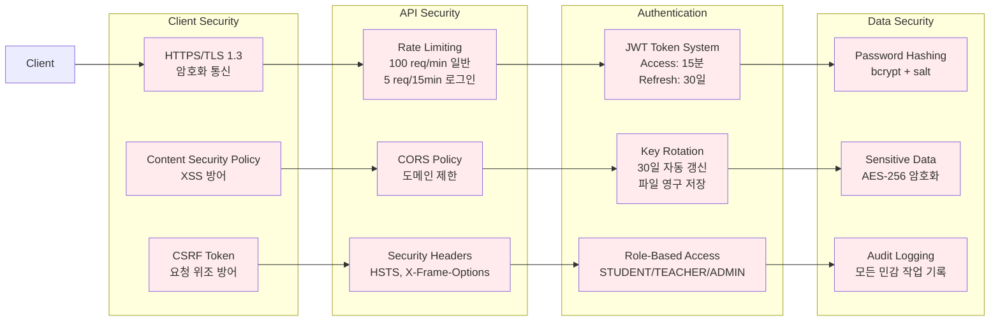
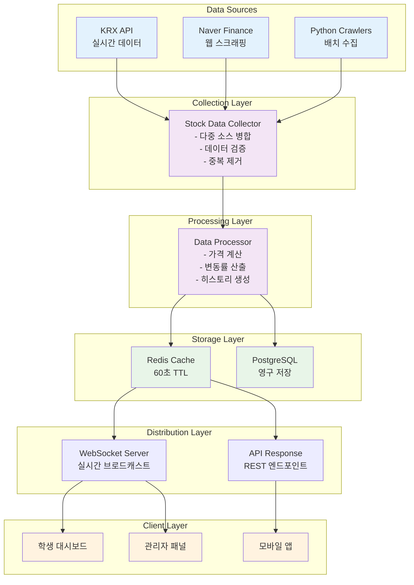
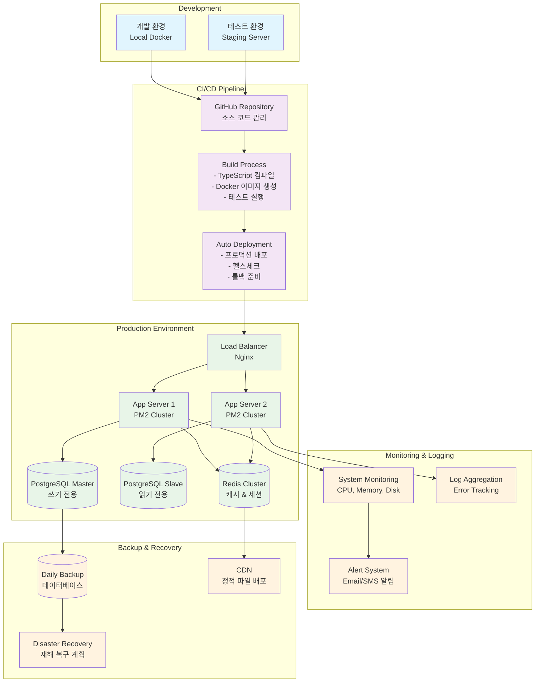
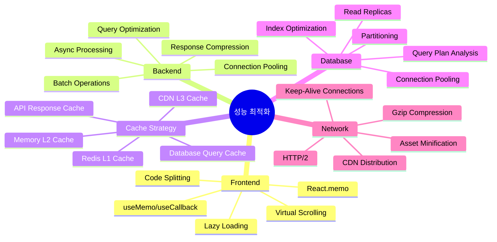

# 경제수학 모의주식 투자 교육 플랫폼
## 시스템 아키텍처 다이어그램

### 🏗️ 전체 시스템 구조



---

### 📊 데이터 플로우 다이어그램



---

### 🔐 보안 아키텍처



---

### 💾 데이터베이스 구조

```mermaid
erDiagram
    User ||--o{ Portfolio : has
    User ||--o{ Transaction : makes
    User ||--o{ Holding : owns
    User ||--o{ Watchlist : creates
    User ||--o{ Notification : receives
    User }o--|| Class : belongs_to
    
    Teacher ||--o{ Class : teaches
    Class ||--o{ AllowedStock : allows
    
    Stock ||--o{ Transaction : involves
    Stock ||--o{ Holding : represents
    Stock ||--o{ PriceHistory : has
    Stock ||--o{ StockPriceHistory : tracks
    Stock ||--o{ AllowedStock : included_in
    Stock ||--o{ Watchlist : watched_in

    User {
        string id PK
        string email UK
        string password
        string name
        enum role
        boolean isActive
        float initialCapital
        float currentCash
        datetime createdAt
    }

    Class {
        string id PK
        string name
        string code UK
        string teacherId FK
        datetime startDate
        datetime endDate
        boolean isActive
    }

    Stock {
        string id PK
        string symbol UK
        string name
        string market
        float currentPrice
        float previousClose
        bigint volume
        boolean isActive
        boolean isTracked
    }

    Portfolio {
        string id PK
        string userId FK
        float totalValue
        float totalCost
        float totalProfitLoss
        float totalProfitLossPercent
    }

    Transaction {
        string id PK
        string userId FK
        string stockId FK
        enum type
        int quantity
        float price
        float totalAmount
        string reason
        datetime createdAt
    }

    Holding {
        string id PK
        string userId FK
        string stockId FK
        int quantity
        float averagePrice
        float currentValue
        float profitLoss
    }
```

---

### ⚡ 실시간 데이터 처리 흐름



---

### 🔄 배포 및 운영 아키텍처



---

### 🎯 성능 최적화 전략



---

이 시스템 아키텍처는 **확장성**, **안정성**, **보안성**을 모두 고려한 엔터프라이즈급 설계로, 교육용 플랫폼의 특수성을 반영한 혁신적인 구조입니다.